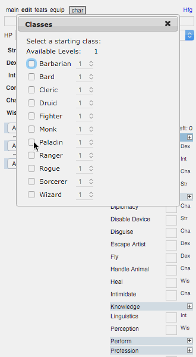
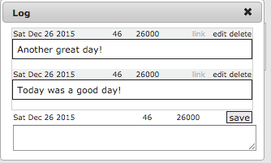
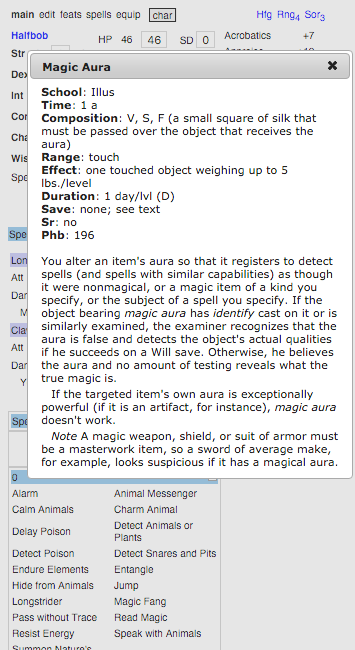

# Player's Companion Character Manager

The Player's Companion Character Manager seeks to ease the burden of managing cascading calculations of character stats, spells, and loot, and provides a quick D20 reference for any skill, feat, spell, class ability.

